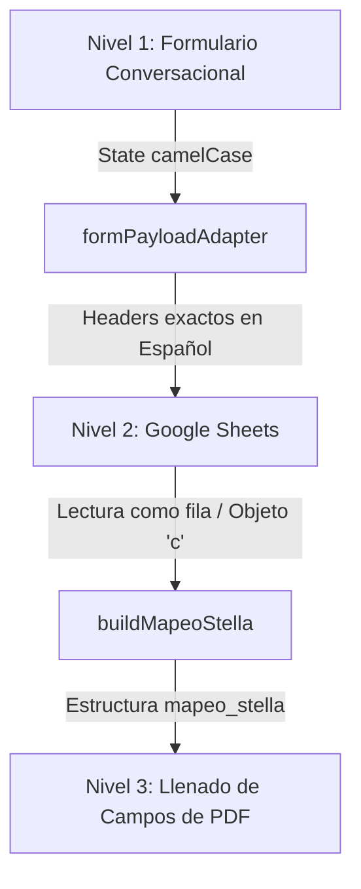

# Flujo de Datos Stellantis: Formulario -> Sheets -> Mapeo Stellantis -> PDF

Este documento explica las tres capas de traducción de datos de la arquitectura del proyecto para garantizar el desacoplamiento entre la interfaz visual del cliente y el documento PDF final.

---

## 📐 Estructura de Tres Niveles

### 1. Nivel 1: Formulario Conversacional (Frontend)
El cliente responde las preguntas paso a paso en español. Cada input mapea a una key camelCase interna en React (ej. `nombreAcreditado`, `rfc`, `calle`).
Esta capa cuenta con validaciones locales de formato en tiempo real para evitar que datos erróneos lleguen a la base de datos.

### 2. Nivel 2: Google Sheets (Almacenamiento)
Antes de enviar el formulario por POST, `formPayloadAdapter.js` transforma las llaves camelCase a las columnas oficiales de la hoja de cálculo usando la configuración centralizada en `stellantisSheetMap.js`.

#### Cabeceros exactos del Google Sheet en orden:
1. `Timestamp` (Generado por Google Apps Script)
2. `Nombre(s) acreditado`
3. `Apellido Paterno acreditado`
4. `Apellido Materno acreditado`
5. `RFC`
6. `CURP`
7. `País de Nacimiento`
8. `Entidad Federativa de nacimiento`
9. `Fecha de Nacimiento`
10. `Número Celular`
11. `Compañia telefonica`
12. `Correo Electrónico`
13. `Calle (solo nombre)`
14. `Numero exterior`
15. `Numero interior`
16. `Colonia acreditado`
17. `Código Postal`
18. `Municipio ó Alcaldía`
19. `Estado`
20. `Ciudad o Población`
21. `Teléfono de casa fijo o celular`
22. `Años de vivir en su domicilio`
23. `¿Qué puesto o actividad desempeñas en tu trabajo?`
24. `Nombre de la Empresa ó Institución`
25. `¿A que se dedica la empresa donde laboras?`
26. `Calle trabajo (solo el nombre)`
27. `Numero exterior trabajo`
28. `Colonia trabajo`
29. `Municipio ó Alcaldía trabajo`
30. `Estado trabajo`
31. `Código Postal trabajo`
32. `Teléfono de oficina y extensión ó directo`
33. `Nombre de tu Jefe Inmediato`
34. `Antigüedad en el empleo, negocio ó jubilado ó pensionado años`
35. `Nombre (solo nombre) referencia 1`
36. `Apellido Paterno (solo nombre) referencia 1`
37. `Parentesco ref 1`
38. `Teléfono de la Referencia 1`
39. `Ocupacion de la referencia 1`
40. `Nombre (solo nombre) referencia 2`
41. `Apellido Paterno (solo nombre) referencia 2`
42. `Parentesco ref 2`
43. `Teléfono de la Referencia 2`
44. `Ocupacion de la referencia 2`
45. `Nombre (solo nombre) referencia 3`
46. `Apellido Paterno (solo nombre) referencia 3`
47. `Parentesco ref 3`
48. `Teléfono de la Referencia 3`
49. `Ocupacion de la referencia 3`

---

### 3. Nivel 3: Mapeo Stellantis (Diccionario para PDF)
Para rellenar la solicitud física de crédito (PDF), el sistema extrae la fila correspondiente de la hoja de cálculo representándola como un diccionario `c`.
La función `buildMapeoStella(c)` definida en [stellantisDerivedFields.js](file:///c:/Users/luism/Documents/stellantis-credit-intake-app/src/flows/stellantis/stellantisDerivedFields.js) calcula campos compuestos y genera el diccionario final con la siguiente lógica:

| Llave PDF final | Origen o Lógica de Derivación |
|---|---|
| `nom_acre` | `c['Nombre(s) acreditado'].toUpperCase()` |
| `ape_pat` | `c['Apellido Paterno acreditado'].toUpperCase()` |
| `ape_mat` | `c['Apellido Materno acreditado'].toUpperCase()` |
| `rfc` | `c['RFC'].toUpperCase()` |
| `curp` | `c['CURP'].toUpperCase()` |
| `fech_lugar_nac` | `"{dia}/{mes}/{anio} - {Entidad Federativa de nacimiento}".toUpperCase()` |
| `num_ext_int` | `"EXT: {Numero exterior} INT: {Numero interior}".toUpperCase()` |
| `calle_final_sol` | Dirección construida completa: `"CALLE: {calle} NO. EXT: {num_ext}... C.P. {cp}"` |
| `ref1_nombre` | `"{Nombre ref 1} {Apellido ref 1}".toUpperCase()` |
| `ref2_nombre` | `"{Nombre ref 2} {Apellido ref 2}".toUpperCase()` |
| `ref3_nombre` | `"{Nombre ref 3} {Apellido ref 3}".toUpperCase()` |
| `nom_vendedor` | Constante `"LUIS FERNANDO MARTINEZ TREJO"` |
| `nom_final_sol` | `"{nom} {pat} {mat}".toUpperCase()` |

---

## 🔌 Escalabilidad: Agregar un Nissan Mapper

Para integrar un formulario de Nissan en el futuro:
1. Agrega una nueva carpeta `src/flows/nissan/`
2. Define `nissanFieldSchema.js`, `nissanFormFlow.js` y `nissanSheetMap.js` con las columnas requeridas por Nissan.
3. Define `nissanDerivedFields.js` para armar el correspondiente `mapeo_nissan` para su PDF.
4. El contenedor de React (`App.jsx` y `ConversationalFormPage.jsx`) es genérico y solo necesitará inyectar el flujo correspondiente según la ruta u opción seleccionada por el usuario.
